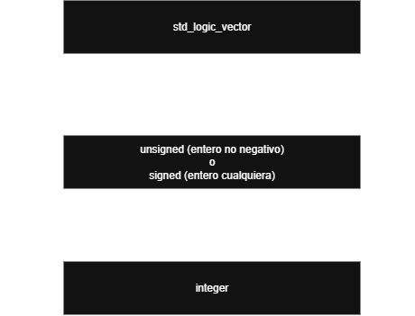

# ⚡ VHDL Cheat Sheet & Quick Reference

Una guía de referencia rápida orientada a la síntesis en FPGAs. Diseñada para copiar, pegar y adaptar rápidamente durante el desarrollo.

---

## 🧱 1. Estructura Básica de un Módulo (Template)

Todo archivo VHDL requiere de tres componentes esenciales: **Librerías**, **Entidad** (interfaz) y **Arquitectura** (comportamiento).


```vhdl
-- 1. DECLARACIÓN DE LIBRERÍAS
library IEEE;
use IEEE.STD_LOGIC_1164.ALL;
use IEEE.NUMERIC_STD.ALL; -- Crucial para operaciones aritméticas (signed/unsigned)

-- 2. ENTIDAD: Define las entradas y salidas del módulo
entity Nombre_Modulo is
    generic (
        ANCHO : integer := 8 -- Parámetro genérico (escalable)
    );
    port (
        clk      : in  std_logic;
        rst      : in  std_logic;
        data_in  : in  std_logic_vector(ANCHO-1 downto 0);
        data_out : out std_logic_vector(ANCHO-1 downto 0)
    );
end Nombre_Modulo;

-- 3. ARQUITECTURA: Define el comportamiento interno
architecture Behavioral of Nombre_Modulo is
    -- Zona de declaraciones (señales internas, constantes, componentes)
    signal sig_interno : std_logic_vector(ANCHO-1 downto 0) := (others => '0');
begin

    -- [La lógica del circuito va aquí]
    data_out <= sig_interno;

end Behavioral;

```

---

## 🔄 2. Conversiones de Tipos (Sistema Estricto)

VHDL es estrictamente tipado. No puedes mezclar `std_logic_vector` con operaciones matemáticas directas (`+`, `-`) sin antes convertirlos.



### Ejemplos de código listos para usar:

```vhdl
-- Señales de prueba para los ejemplos:
signal v_vector  : std_logic_vector(7 downto 0);
signal u_unsig   : unsigned(7 downto 0);
signal s_sig     : signed(7 downto 0);
signal i_entero  : integer range 0 to 255;

-- 1. De VECTOR a UNSIGNED / SIGNED
u_unsig <= unsigned(v_vector);
s_sig   <= signed(v_vector);

-- 2. De UNSIGNED / SIGNED a VECTOR
v_vector <= std_logic_vector(u_unsig);
v_vector <= std_logic_vector(s_sig);

-- 3. De UNSIGNED / SIGNED a INTEGER
i_entero <= to_integer(u_unsig);
i_entero <= to_integer(s_sig);

-- 4. De INTEGER a UNSIGNED / SIGNED (requiere especificar tamaño en bits)
u_unsig <= to_unsigned(i_entero, 8);
s_sig   <= to_signed(i_entero, 8);

```

---

## ⚡ 3. Lógica Combinacional (Lógica Concurrente)

*Se ejecuta fuera de bloques `process`. Todo ocurre en paralelo de forma asíncrona.*

### Asignación Condicional (`when / else`)

```vhdl
-- Ideal para multiplexores simples
salida <= entrada_a when (sel = '11') else
         entrada_b when (sel = '00') else
         entrada_c;

```

### Asignación Seleccionada (`with / select`)

```vhdl
-- Equivalente a un multiplexor de múltiples entradas o decodificador
with operacion select
    resultado <= entrada_a + entrada_b when "00",
                 entrada_a - entrada_b when "01",
                 entrada_a and entrada_b when "10",
                 (others => '0')         when others; -- Obligatorio cubrir todos los casos

```

---

## ⏱️ 4. Lógica Secuencial (Bloques `process`)

*Se ejecuta de forma síncrona evaluando una lista de sensibilidad. Dentro del `process` se usan estructuras condicionales tradicionales.*

⚠️ **Regla de oro:** Dentro de un `process` se usa obligatoriamente `if/else` y `case`. **No** se permite usar `when/else` ni `with/select`.

### Flanco de Reloj con Reset Asíncrono (Recomendado para FPGAs)

```vhdl
process(clk, rst)
begin
    if rst = '1' then
        -- Reset asíncrono: Limpia registros inmediatamente
        registro_q <= (others => '0'); -- Inicializa todo el vector en '0'
    elsif rising_edge(clk) then
        -- Flanco de subida del reloj (Síncrono)
        registro_q <= registro_d;
    end if;
end process;

```

### Estructura `case` (Dentro de un `process`)

```vhdl
process(estado_actual)
begin
    case estado_actual is
        when "00" =>
            salida_control <= '1';
        when "01" | "10" =>   -- Operador OR lógico para agrupar casos
            salida_control <= '0';
        when others =>        -- Siempre incluir para evitar latches accidentales
            salida_control <= '0';
    end case;
end process;

```

---

## 🤖 5. Plantilla de Máquina de Estados (FSM)

Estructura clásica de **2 procesos** para implementar una Máquina de Estados de manera limpia y robusta (separando lógica combinacional de la secuencial).

```vhdl
-- 1. Declaración del tipo enumerado para los estados (en la zona de señales)
type t_estado is (IDLE, PROCESANDO, ALERTA);
signal estado_pres, estado_sig : t_estado;

-- [Dentro del cuerpo de la arquitectura]

-- PROCESO 1: Registro de Estado (Secuencial / Síncrono)
process(clk, rst)
begin
    if rst = '1' then
        estado_pres <= IDLE;
    elsif rising_edge(clk) then
        estado_pres <= estado_sig;
    end if;
end process;

-- PROCESO 2: Lógica de Transición y Salidas (Combinacional)
process(estado_pres, boton_start, sensor_limite)
begin
    -- Valores por defecto para evitar latches
    estado_sig     <= estado_pres;
    activar_motor  <= '0';

    case estado_pres is
        when IDLE =>
            if boton_start = '1' then
                estado_sig <= PROCESANDO;
            end if;

        when PROCESANDO =>
            activar_motor <= '1';
            if sensor_limite = '1' then
                estado_sig <= ALERTA;
            end if;

        when ALERTA =>
            if boton_start = '0' then -- Espera liberación de botón
                estado_sig <= IDLE;
            end if;
            
        when others =>
            estado_sig <= IDLE;
    end case;
end process;

```

---

## 🧩 6. Instanciación de Componentes (Jerarquía)

Cómo conectar un módulo hijo dentro de un módulo padre (Mapeo de puertos).

```vhdl
-- 1. Instanciación por posición (No recomendada, propensa a errores)
u_reloj_inst : entidad_reloj port map (clk, rst, clk_dividido);

-- 2. Instanciación por nombre (RECOMENDADA, explícita y segura)
u_controlador : entity work.Nombre_Modulo
    generic map (
        ANCHO => 16 -- Sobrescribe el valor por defecto del generic
    )
    port map (
        clk      => clk_sistema, -- puerto_del_hijo => senal_del_padre
        rst      => rst_global,
        data_in  => bus_datos,
        data_out => open           -- 'open' deja la salida desconectada de forma segura
    );

```

---

## 🛠️ 7. Inicializaciones Rápidas y Operadores

### Formas Rápidas de Llenar Vectores

```vhdl
data <= (others => '0');     -- Llena todo el vector con ceros ("00000000")
data <= (others => '1');     -- Llena todo el vector con unos ("11111111")
data <= (7 => '1', others => '0'); -- Pone el MSB en '1' y el resto en '0' ("10000000")

```

### Operadores de Concatenación y Reducción

```vhdl
-- Concatenación (&)
bus_grande <= bit_alto & bus_medio & "00";

-- Concatenación repetida (VHDL-2008)
bus_repetido <= (others => bit_control);

```

"""
